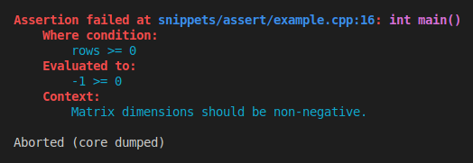

[](https://en.cppreference.com/w/cpp/17.html)
[](LICENSE.md)
[](guide_versioning.md)
[](https://dmitribogdanov.github.io/UTL/)
[](https://en.wikipedia.org/wiki/Header-only)
[](https://github.com/DmitriBogdanov/UTL/tree/master/include/UTL)

[](https://github.com/DmitriBogdanov/UTL/actions/workflows/windows.yml)
[](https://github.com/DmitriBogdanov/UTL/actions/workflows/ubuntu.yml)
[](https://github.com/DmitriBogdanov/UTL/actions/workflows/macos.yml)
[](https://github.com/DmitriBogdanov/UTL/actions/workflows/freebsd.yml)

# utl::assertion

[<- to README.md](..)

[<- to implementation.hpp](../include/UTL/math.hpp)

**utl::assertion** header provides an (almost) drop-in replacement for the standard `assert()` with nicer semantics and more diagnostic info.

**Quick showcase:**

```cpp
const int rows = -1;

ASSERT(rows >= 0, "Matrix dimensions should be non-negative.");
```



**Main features:**

- Decomposes expressions and prints their values
- Has an optional message argument
- Customizable assert handler
- Nicely colored output
- An option to enable assertions in `Release`
- An option to throw instead of aborting

## Definitions

```cpp
// Assertion macro
#define UTL_ASSERTION(condition, ...)

// Options (declared by the user)
#define UTL_ASSERTION_ENABLE_SHORTCUT
#define UTL_ASSERTION_ENABLE_IN_RELEASE
#define UTL_ASSERTION_ENABLE_THROW_ON_FAILURE

// Handler customization
struct FailureInfo {
    std::string_view file;
    std::size_t      line;
    std::string_view func;
    
    std::string_view expression;
    std::string_view evaluated;
    std::string_view context;
    
    std::string to_string(bool color = false) const;
};

void set_handler(std::function<void(const FailureInfo&)> handler);
```

## Methods

### Assertion macro

> ```cpp
> #define UTL_ASSERTION(condition, ...)
> ```

A macro semantically similar to [`assert()`](https://en.cppreference.com/w/cpp/error/assert.html).

In `Debug` mode (which means `NDEBUG` is defined) checks whether `condition` is `true` and invokes assert handler in the case of failure.

In `Release` mode (which means `NDEBUG` is not defined) compiles to nothing.

**Differences relative to the standard `assert()`:**

- This macro can be customized using [options](#options)
- This macro also accepts message as an optional second parameter
- This macro also performs expression decomposition to print more diagnostic info
- Assert handler invoked by the failure is customizable (which is usually used to log failures, print stack traces and change failure behavior)

### Options

> ```cpp
> #define UTL_ASSERTION_ENABLE_SHORTCUT // declared by the user
> ```

When defined before including the header, this macro enables shortcut `ASSERT()` for `UTL_ASSERTION()`.

> ```cpp
> #define UTL_ASSERTION_ENABLE_IN_RELEASE // declared by the user
> ```

When defined before including the header, this macro enables assertion checking in `Release` mode.

> ```cpp
> #define UTL_ASSERTION_ENABLE_THROW_ON_FAILURE // declared by the user
> ```

When defined before including the header, this macro changes default assertion handler to throw [`std::runtime_error`](https://www.cppreference.com/w/cpp/error/runtime_error.html) instead of calling [`std::abort`](https://en.cppreference.com/w/cpp/utility/program/abort.html).

**Note:** Similar effect can be achieved using a custom handler, this is mostly a convenience option.

### Handler customization

> ```cpp
> struct FailureInfo {
>     std::string_view file;
>     std::size_t      line;
>     std::string_view func;
>     
>     std::string_view expression;
>     std::string_view evaluated;
>     std::string_view context;
>     
>     std::string to_string(bool color = false) const;
> };
> ```

A struct that contains all of the information about a failed assertion:

| Field                      | Content                                                      |
| -------------------------- | ------------------------------------------------------------ |
| `file` / `line` / `func`   | File / line / function from which assertion failure was triggered |
| `expression `/ `evaluated` | Asserted condition before / after being evaluated            |
| `context`                  | Optional message                                             |

Can be stringified with `to_string()` method, which uses ANSI color codes to improve readability when `color` is set to `true`.

**Note:** If `context` was no provided, it defaults to `<no context provided>`

> ```cpp
> void set_handler(std::function<void(const FailureInfo&)> handler);
> ```

**Note 1:** Assertion failure `handler` is invoked in a **thread-safe** manner.

**Note 2:** Default handler prints the colored failure info to [`std::cerr`](https://en.cppreference.com/w/cpp/io/cerr.html) and calls [`std::abort`](https://en.cppreference.com/w/cpp/utility/program/abort.html).

## Examples

> [!Important]
> All of the examples below will use
>
> ```cpp
> #define UTL_ASSERTION_ENABLE_SHORTCUT
> #define UTL_ASSERTION_ENABLE_THROW_ON_FAILURE
> ```
> and define
> ```
> #define TRY(expr) try { expr } catch (std::exception& e) { std::cout << e.what(); }
> ```
> to reduce verbosity and allow running examples as tests.

### Unary assertion

[ [Run this code]() ] [ [Open source file]() ]

```cpp
const auto vec = std::vector{ 1, 2, 3 };

TRY( ASSERT(vec.empty(), "Vector should be empty at the end of the algorithm."); )
```

Output:

### Binary assertion

[ [Run this code]() ] [ [Open source file]() ]

```cpp
const int rows = -1;

TRY( ASSERT(rows >= 0, "Matrix dimensions should be non-negative."); )
```

Output:

### Default message

[ [Run this code]() ] [ [Open source file]() ]

```cpp
TRY( ASSERT(2 + 4 == 17) )
```

Output:

### Logging on failure

[ [Run this code]() ] [ [Open source file]() ]

```cpp
utl::assertion::set_handler([](const FailureInfo& info) {
    // Forward assertion message to some logging facility with colors disabled
    std::ofstream("failure.txt") << info.to_string();
    
    // Print & abort like usually
    std::cerr << info.to_string(true);
    std::abort();
});

TRY( ASSERT((2 + 3 == 5) && (2 + 3 == 6)); )
```

Output:


`failure.txt`:

```
```

### Throwing custom exception on failure

[ [Run this code]() ] [ [Open source file]() ]

```cpp
// Custom exception
struct AssertionFailure : std::runtime_error {
    using std::runtime_error::runtime_error; // inherit constructors
};

// Throw that custom exception on assert failure
utl::assertion::set_handler([](const FailureInfo& info) {
    throw AssertionFailure(info.to_string());
});

TRY( ASSERT((2 + 3 == 5) && (2 + 3 == 6)); )
```

Output:

