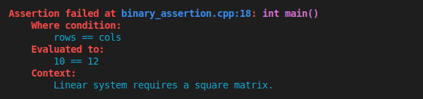

[](https://en.cppreference.com/w/cpp/17.html)
[](LICENSE.md)
[](guide_versioning.md)
[](https://dmitribogdanov.github.io/UTL/)
[](https://en.wikipedia.org/wiki/Header-only)
[](https://github.com/DmitriBogdanov/UTL/tree/master/include/UTL)

[](https://github.com/DmitriBogdanov/UTL/actions/workflows/windows.yml)
[](https://github.com/DmitriBogdanov/UTL/actions/workflows/ubuntu.yml)
[](https://github.com/DmitriBogdanov/UTL/actions/workflows/macos.yml)
[](https://github.com/DmitriBogdanov/UTL/actions/workflows/freebsd.yml)

# utl::assertion

[<- to README.md](..)

[<- to implementation.hpp](../include/UTL/math.hpp)

**utl::assertion** header provides an (almost) drop-in replacement for the standard `assert()` with nicer semantics and more diagnostic info.

**Quick showcase:**

```cpp
const int rows = 10;
const int cols = 12;

TRY( ASSERT(rows == cols, "Linear system requires a square matrix."); )
```



**Main features:**

- Decomposes expressions and prints their values
- Has an optional message argument
- Customizable assert handler
- Nicely colored output
- An option to enable assertions in `Release`
- An option to throw instead of aborting

## Definitions

```cpp
// Assertion macro
#define UTL_ASSERTION(condition, ...)

// Options (declared by the user)
#define UTL_ASSERTION_ENABLE_SHORTCUT
#define UTL_ASSERTION_ENABLE_IN_RELEASE
#define UTL_ASSERTION_ENABLE_FULL_PATHS

// Handler customization
struct FailureInfo {
    std::string_view file;
    std::size_t      line;
    std::string_view func;
    
    std::string_view expression;
    std::string_view evaluated;
    std::string_view context;
    
    std::string to_string(bool color = false) const;
};

void set_handler(std::function<void(const FailureInfo&)> handler);
```

## Methods

### Assertion macro

> ```cpp
> #define UTL_ASSERTION(condition, ...)
> ```

A macro semantically similar to [`assert()`](https://en.cppreference.com/w/cpp/error/assert.html).

In `Debug` mode (which means `NDEBUG` is defined) checks whether `condition` is `true` and invokes assert handler in the case of failure.

In `Release` mode (which means `NDEBUG` is not defined) compiles to nothing.

**Differences relative to the standard `assert()`:**

- This macro can be customized using [options](#options)
- This macro also accepts message as an optional second parameter
- This macro also performs expression decomposition to print more diagnostic info
- Assert handler invoked by the failure is customizable (which is usually used to log failures, print stack traces and change failure behavior)

**Limitations:**

- Only simple expressions without parenthesis can be decomposed (such as `a - b`, `a + b < c` and etc.)
- Decomposed values should be printable using [`std::ostream`](https://en.cppreference.com/w/cpp/io/basic_ostream.html)

### Options

> ```cpp
> #define UTL_ASSERTION_ENABLE_SHORTCUT // declared by the user
> ```

When defined before including the header, this macro enables shortcut `ASSERT()` for `UTL_ASSERTION()`.

> ```cpp
> #define UTL_ASSERTION_ENABLE_IN_RELEASE // declared by the user
> ```

When defined before including the header, this macro enables assertion checking in `Release` mode.

> ```cpp
> #define UTL_ASSERTION_ENABLE_FULL_PATHS // declared by the user
> ```

When defined before including the header, this macro enables full filepath display in failed assertions. By default only filename is displayed.

**Note:** Full filepath can be rather verbose when using build systems such as **CMake** due to their tendency to pass absolute paths to the compiler.

### Handler customization

> ```cpp
> struct FailureInfo {
>     std::string_view file;
>     std::size_t      line;
>     std::string_view func;
>     
>     std::string_view expression;
>     std::string_view evaluated;
>     std::string_view context;
>     
>     std::string to_string(bool color = false) const;
> };
> ```

A struct that contains all of the information about a failed assertion:

| Field                      | Content                                                      |
| -------------------------- | ------------------------------------------------------------ |
| `file` / `line` / `func`   | File / line / function from which assertion failure was triggered |
| `expression `/ `evaluated` | Asserted condition before / after being evaluated            |
| `context`                  | Optional message                                             |

Can be stringified with `to_string()` method, which uses ANSI color codes to improve readability when `color` is set to `true`.

**Note:** If `context` was no provided, it defaults to `<no context provided>`

> ```cpp
> void set_handler(std::function<void(const FailureInfo&)> handler);
> ```

**Note 1:** Assertion failure `handler` is invoked in a **thread-safe** manner.

**Note 2:** Default handler prints the colored failure info to [`std::cerr`](https://en.cppreference.com/w/cpp/io/cerr.html) and calls [`std::abort`](https://en.cppreference.com/w/cpp/utility/program/abort.html).

## Examples

> [!Important]
> All of the examples below will use
>
> ```cpp
> #define UTL_ASSERTION_ENABLE_SHORTCUT
> #define UTL_ASSERTION_ENABLE_IN_RELEASE
> ```
> to reduce verbosity and wrap the code in
> ```cpp
> std::signal(SIGABRT, [](int){ std::quick_exit(EXIT_SUCCESS); });
> // ...
> return EXIT_FAILURE;
> ```
> to allow running examples as tests which fail should the assertion not trigger.

### Unary assertion

[ [Run this code]() ] [ [Open source file](../examples/module_assertion/unary_assertion.cpp) ]

```cpp
std::unique_ptr<int> component;

ASSERT(component.get(), "Cannot invoke handling for an empty component.");
```

Output:


### Binary assertion

[ [Run this code]() ] [ [Open source file](../examples/module_assertion/binary_assertion.cpp) ]

```cpp
const int rows = 10;
const int cols = 12;

ASSERT(rows == cols, "Linear system requires a square matrix.");
```

Output:


### Default message

[ [Run this code]() ] [ [Open source file]() ]

```cpp
// Second argument is optional, this can be used like a regular assert
ASSERT(2 + 4 == 17);
```

Output:

### Logging on failure

[ [Run this code]() ] [ [Open source file]() ]

```cpp
utl::assertion::set_handler([](const utl::assertion::FailureInfo& info) {
    // Forward assertion message to some logging facility with colors disabled
    std::ofstream("failure.txt") << info.to_string();
    
    // Print & abort like usually
    std::cerr << info.to_string(true);
    std::abort();
});

ASSERT(3 + 4 < 6);
```

Output:

`failure.txt`:

```
```
