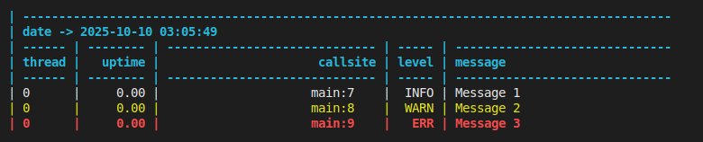
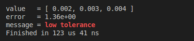
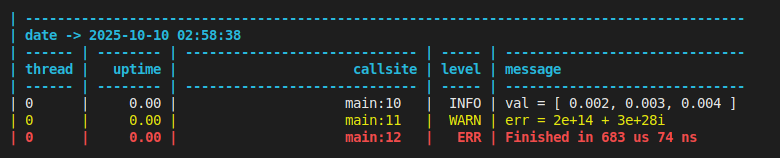
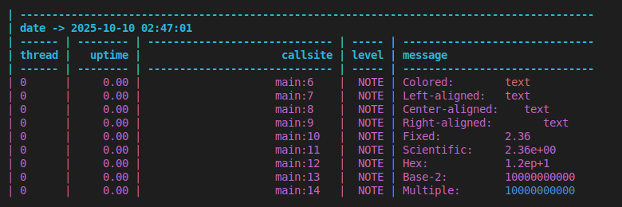
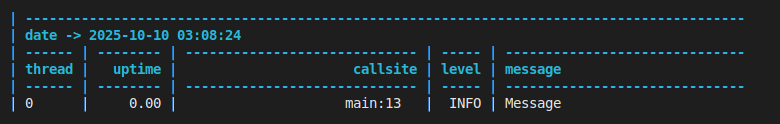

# utl::log

[<- to README.md](..)

[<- to implementation.hpp](https://github.com/DmitriBogdanov/UTL/blob/master/include/UTL/log.hpp)

**utl::log** is a lean logging library that tries to make log syntax as simple as possible. It uses type traits to deduce how to serialize various types without depending on its their explicit support, while still providing customization points through formatter specialization. Due to compile-time parametrization & custom formatting the logger achieves significantly lower overhead than standard [`std::ostream`](https://en.cppreference.com/w/cpp/io/basic_ostream.html)-based solutions.

Key features:

- Simple API with no macros
- Serializes [almost every type & container](#serialization-support)
- Automatically adapts to containers with std-like API
- Concise syntax for alignment / color / number formatting
- Sync/async logging with various buffering policies
- Convenient `println()` and `stringify()`

Quirks of the library:

- Variadic syntax
- Compile-time parametrization
- Built-in formatting system

**Quick showcase:**

```cpp
log::info("Message 1");
log::warn("Message 2");
log::err ("Message 3");
```



```cpp
const auto start = std::chrono::steady_clock::now();

log::println("value   = "  , std::vector{2e-3, 3e-3, 4e-3}           );
log::println("error   = "  , 1.357 | log::scientific(2)              );
log::println("message = "  , "low tolerance" | log::color::bold_red  );
log::println("Finished in ", std::chrono::steady_clock::now() - start);
```



## Definitions

```cpp
// Logger
template <class... Sinks>
struct Logger {
    Logger(Sinks&&... sinks);
    
    template <class... Args> void err  (const Args&... args);
    template <class... Args> void warn (const Args&... args);
    template <class... Args> void note (const Args&... args);
    template <class... Args> void info (const Args&... args);
    template <class... Args> void debug(const Args&... args);
    template <class... Args> void trace(const Args&... args);
};

// Sink
template <
    policy::Type      type,     = /* inferred from constructor */,
    policy::Level     level     = /* defaults based on 'type'  */,
    policy::Color     color     = /* defaults based on 'type'  */,
    policy::Format    format    = /* defaults based on 'type'  */,
    policy::Buffering buffering = /* defaults based on 'type'  */,
    policy::Flushing  flushing  = /* defaults based on 'type'  */,
    policy::Threading threading = /* defaults based on 'type'  */
> struct Sink {
    Sink(std::ofstream&&  file); // for file   sinks
    Sink(std::string_view name); // for file   sinks
    Sink(std::ostream&      os); // for stream sinks
    Sink(std::string&      str); // for string sinks
};

// Policies
namespace policy {
    enum class Type      { FILE, STREAM };
    enum class Level     { ERR, WARN, NOTE, INFO, DEBUG, TRACE };
    enum class Color     { NONE, ANSI };
    enum class Format    { DATE, TITLE, THREAD, UPTIME, CALLSITE, LEVEL, NONE, FULL }; // bitmask
    enum class Buffering { NONE, FIXED, TIMED };
    enum class Flushing  { SYNC, ASYNC };
    enum class Threading { UNSAFE, SAFE };
}

// Pre-defined global logger
template <class... Args> void err  (const Args&... args);
template <class... Args> void warn (const Args&... args);
template <class... Args> void note (const Args&... args);
template <class... Args> void info (const Args&... args);
template <class... Args> void debug(const Args&... args);
template <class... Args> void trace(const Args&... args);

// Printing
template <class... Args> void print  (const Args&... args);
template <class... Args> void println(const Args&... args);

template <class... Args> std::string stringify(const Args&... args);

// Formatting modifiers
constexpr mods::FloatFormat general     (std::size_t precision = 6) noexcept;
constexpr mods::FloatFormat fixed       (std::size_t precision = 3) noexcept;
constexpr mods::FloatFormat scientific  (std::size_t precision = 3) noexcept;
constexpr mods::FloatFormat hex         (std::size_t precision = 3) noexcept;
constexpr mods::IntFormat   base        (std::size_t base         ) noexcept;
constexpr mods::AlignLeft   align_left  (std::size_t size         ) noexcept;
constexpr mods::AlignCenter align_center(std::size_t size         ) noexcept;
constexpr mods::AlignRight  align_right (std::size_t size         ) noexcept;
// + all ANSI colors, see methods for the full list

template <class T>
constexpr /*formatted-value*/ operator|(T&& value, /*formatting-mod*/ modifier) noexcept;
```

## Methods

### Logger

> ```cpp
> template <class... Sinks>
> struct Logger {
>     Logger(Sinks&&... sinks);
>     
>     template <class... Args> void err  (const Args&... args);
>     template <class... Args> void warn (const Args&... args);
>     template <class... Args> void note (const Args&... args);
>     template <class... Args> void info (const Args&... args);
>     template <class... Args> void debug(const Args&... args);
>     template <class... Args> void trace(const Args&... args);
> };
> ```

A **logger** containing one or several sinks.

Functions `err()` / `warn()` / `note()` / `info()` / `debug()` / `trace()` create log entries at corresponding [verbosity levels](#level) with `args...` as a message.

**Note:** The `Logger` object can be used [locally](#local-logger) as a regular [RAII](https://en.cppreference.com/w/cpp/language/raii.html) object, or wrapped in a function to work [globally](#global-logger).

### Sink

> ```cpp
> template <
>     policy::Type      type,     = /* inferred from constructor */,
>     policy::Level     level     = /* defaults based on 'type'  */,
>     policy::Color     color     = /* defaults based on 'type'  */,
>     policy::Format    format    = /* defaults based on 'type'  */,
>     policy::Buffering buffering = /* defaults based on 'type'  */,
>     policy::Flushing  flushing  = /* defaults based on 'type'  */,
>     policy::Threading threading = /* defaults based on 'type'  */
> > struct Sink {
>     Sink(std::ofstream&&  file); // for file   sinks
>     Sink(std::string_view name); // for file   sinks
>     Sink(std::ostream&      os); // for stream sinks
>     Sink(std::string&      str); // for string sinks
> };
> ```

Logger **sink** is a wrapper around the file handle ([`std::ofstream`](https://en.cppreference.com/w/cpp/io/basic_ofstream.html)) or stream ([`std::ostream&`](https://en.cppreference.com/w/cpp/io/basic_ostream.html)) that handles writing log messages to them.

`Sink` behavior can be customized at compile-time using **policies**. See the [example](#sink-configuration).

By default, the `Sink` will infer its `type` based on the constructor argument, while its policies get defaulted to suit the common use case:

| Type                | `Type::STREAM`    | `Type::FILE`       |
| ------------------- | ----------------- | ------------------ |
| Default `level`     | `Level::INFO`     | `Level::TRACE`     |
| Default `color`     | `Color::ANSI`     | `Color::NONE`      |
| Default `format`    | `Format::FULL`    | `Format::FULL`     |
| Default `buffering` | `Buffering::NONE` | `Buffering::FIXED` |
| Default `flushing`  | `Flushing::SYNC`  | `Flushing::ASYNC`  |
| Default `threading` | `Threading::SAFE` | `Threading::SAFE`  |

### Policies

> [!Note]
> All policies reside in a `log::policy` namespace.

#### Type

> ```cpp
> enum class Type { FILE, STREAM };
> ```

Specifies the **output type** of the sink:

| Value          | Output type                                                  |
| -------------- | ------------------------------------------------------------ |
| `Type::FILE`   | File handle ([`std::ofstream`](https://en.cppreference.com/w/cpp/io/basic_ofstream.html)) |
| `Type::STREAM` | Stream ([`std::ostream&`](https://en.cppreference.com/w/cpp/io/basic_ostream.html)) |

#### Level

> ```cpp
> enum class Level { ERR, WARN, NOTE, INFO, DEBUG, TRACE };
> ```

Specifies the **verbosity level** of the sink:

| Value          | Verbosity level  |
| -------------- | ---------------- |
| `Level::ERR`   | `ERR` only       |
| `Level::WARN`  | `WARN` or above  |
| `Level::NOTE`  | `NOTE` or above  |
| `Level::INFO`  | `INFO` or above  |
| `Level::DEBUG` | `DEBUG` or above |
| `Level::TRACE` | `TRACE` or above |

#### Color

> ```cpp
> enum class Color { NONE, ANSI };
> ```

Specifies the **color setting** of the sink:

| Value         | Color setting                                                |
| ------------- | ------------------------------------------------------------ |
| `Color::NONE` | Ignore color modifiers                                       |
| `Color::ANSI` | Use [ANSI escape sequences](https://en.wikipedia.org/wiki/ANSI_escape_code) to format color modifiers |

#### Format

> ```cpp
> enum class Format { DATE, TITLE, THREAD, UPTIME, CALLSITE, LEVEL, NONE, FULL };
> ```

Specifies the **enabled parts** of the sink output:

| Value      | Enabled parts                                       |
| ---------- | --------------------------------------------------- |
| `DATE`     | Date & time at the top of the log                   |
| `TITLE`    | Column titles at the top of the log                 |
| `THREAD`   | Thread id column                                    |
| `UPTIME`   | Uptime in milliseconds column                       |
| `CALLSITE` | Callsite column                                     |
| `LEVEL`    | Message level column                                |
| `NONE`     | Only message is displayed                           |
| `FULL`     | `DATE | TITLE | THREAD | UPTIME | CALLSITE | LEVEL` |

**Note:** This `enum` works like bitmask, for example, value `THREAD | UPTIME` will correspond to formatting both columns.

#### Buffering

> ```cpp
> enum class Buffering { NONE, FIXED, TIMED };
> ```

Specifies the **buffering strategy** of the sink output:

| Value              | Buffering strategy                           |
| ------------------ | -------------------------------------------- |
| `Buffering::NONE`  | All output is flushed immediately            |
| `Buffering::FIXED` | Output is flushed after every 8 KiB          |
| `Buffering::TIMED` | Output is flushed after every 5 milliseconds |

**Note:** Instant buffering tends to be useful during debugging as it ensures no lost messages in case of a crash. Fixed buffering strategy is generally the most reliable in terms of performance. Timed buffering is a hybrid solution that doesn't suffer the full slowdown of instant buffering while still keeping the logs close to the real-time. 

#### Flushing

> ```cpp
> enum class Flushing  { SYNC, ASYNC };
> ```

Specifies the **flushing strategy** of the sink output:

| Value             | Flushing strategy                                      |
| ----------------- | ------------------------------------------------------ |
| `Flushing::SYNC`  | Flushing is performed on the same thread               |
| `Flushing::ASYNC` | Flushing is performed asynchronously on another thread |

**Note:** Async flushing reduces logging latency for the caller, but increases the total amount of work that needs to be done by all threads. It is generally beneficial unless all threads are 100% busy.

#### Threading

> ```cpp
> enum class Threading { UNSAFE, SAFE };
> ```

Specifies the **thread safety** of the sink output:

| Value               | Thread safety              |
| ------------------- | -------------------------- |
| `Threading::UNSAFE` | Logging is not thread-safe |
| `Threading::SAFE`   | Logging is thread-safe     |

**Note:** Disabling thread safety is generally not advised, but can lead to a performance increase in single-threaded scenarios.

### Pre-defined global logger

> ```cpp
> template <class... Args> void err  (const Args&... args);
> template <class... Args> void warn (const Args&... args);
> template <class... Args> void note (const Args&... args);
> template <class... Args> void info (const Args&... args);
> template <class... Args> void debug(const Args&... args);
> template <class... Args> void trace(const Args&... args);
> ```

Convenience alias for the `err()` / `warn()` / `note()` / `info()` / `debug()` / `trace()` methods of a pre-defined global logger.

The default logger is lazily initialized upon the first call to these functions, it sinks to [`std::cout`](https://en.cppreference.com/w/cpp/io/cout.html) and `latest.log` file using the default sink policies .

### Printing

> ```cpp
> template <class... Args> void print  (const Args&... args);
> template <class... Args> void println(const Args&... args);
> ```

Prints `args...` to [`std::cout`](https://en.cppreference.com/w/cpp/io/cout.html) using the formatter logic of this library.

This is particularly useful during debugging and general CLI work, as `println()` is both more concise that regular `std::cout` usage and supports a large variety of types that can't be serialized by default. **Formatting modifiers** are also fully supported which allows coloring, alignment and numeric formatting beyond the regular capabilities of stream [`<ios>`](https://en.cppreference.com/w/cpp/header/ios.html).

In addition to this, `println()` is fully thread-safe and locale-independent (unless locale dependency is introduced by the user defining a custom formatter specialization).

> ```cpp
> template <class... Args> std::string stringify(const Args&... args);
> ```

Formats `args...` into an [`std::string`](https://en.cppreference.com/w/cpp/string/basic_string.html) using the formatter logic of this library.

This functions is effectively a universal variadic version of [`std::to_string()`](https://en.cppreference.com/w/cpp/string/basic_string/to_string.html).

**Note:** Due to a heavy compile-time logic utilization, this function is likely to significantly outperform any stringification based on [`std::stringstream`](https://en.cppreference.com/w/cpp/io/basic_stringstream.html). It also heavily outperforms floating-point [`std::to_string()`](https://en.cppreference.com/w/cpp/string/basic_string/to_string.html) and [`sprintf()`](https://en.cppreference.com/w/cpp/io/c/snprintf) due to a more advanced floating-point serialization algorithm based on [`<charconv>`](https://en.cppreference.com/w/cpp/header/charconv.html). Similarly to the `println()`, the output is locale-independent by default.

### Formatting modifiers

> ```cpp
> template <class T>
> constexpr /*formatted-value*/ operator|(T&& value, /*formatting-mod*/ modifier) noexcept;
> ```

Formatting `modifier` can be applied to a `value` by using the `operator|` on its right-hand side.

For example, `x | mod_1 | mod_2` will apply formatting modifiers `mod_1` and `mod_2` to the value `x`.

### Numeric format

> ```cpp
> constexpr mods::FloatFormat general    (std::size_t precision = 6) noexcept;
> constexpr mods::FloatFormat fixed      (std::size_t precision = 3) noexcept;
> constexpr mods::FloatFormat scientific (std::size_t precision = 3) noexcept;
> constexpr mods::FloatFormat hex        (std::size_t precision = 3) noexcept;
> ```

Modifiers that specify the precision and format of a floating point value.

**Note 1:** Only applicable to floating-point values, this is checked at compile-time.

**Note 2:** By default, general format is used with precision chosen according to the shortest representation, see [`std::to_chars()`](https://en.cppreference.com/w/cpp/utility/to_chars.html).

**Note 3:** Standard streams implement similar behavior using [`std::setprecision`](https://en.cppreference.com/w/cpp/io/manip/setprecision.html) in combination with [`std::fixed`](https://en.cppreference.com/w/cpp/io/manip/fixed) / [`std::scientific`](https://en.cppreference.com/w/cpp/io/manip/fixed) / [`std::hexfloat`](https://en.cppreference.com/w/cpp/io/manip/fixed) / [`std::defaultfloat`](https://en.cppreference.com/w/cpp/io/manip/fixed).

> ```cpp
> constexpr mods::IntFormat base(std::size_t base) noexcept;
> ```

Modifier that specifies the base of an integer value.

**Note 1:** Only applicable to integer values, this is checked at compile-time.

**Note 2:** By default, integers are serialized in base `10`.

**Note 3:** Standard streams implement similar behavior for base `10` / `16` / `8` using [`std::dec`](https://en.cppreference.com/w/cpp/io/manip/hex.html) / [`std::hex`](https://en.cppreference.com/w/cpp/io/manip/hex.html) / [`std::oct`](https://en.cppreference.com/w/cpp/io/manip/hex.html), other arbitrary bases are not supported by standard [`<ios>`](https://en.cppreference.com/w/cpp/header/ios.html).

#### Alignment

> ```cpp
> constexpr mods::AlignLeft   align_left  (std::size_t size) noexcept;
> constexpr mods::AlignCenter align_center(std::size_t size) noexcept;
> constexpr mods::AlignRight  align_right (std::size_t size) noexcept;
> ```

Modifiers that specify the horizontal alignment of serialized value.

**Note 1:** When serialized value is `size` or more characters long, it is left unchanged.

**Note 2:** Standard streams implement similar behavior using [`std::setw()`](https://en.cppreference.com/w/cpp/io/manip/setw.html) in combination with [`std::left`](https://en.cppreference.com/w/cpp/io/manip/left) / [`std::right`](https://en.cppreference.com/w/cpp/io/manip/left), except there is no manipulator for central alignment.

#### Colors

> ```cpp
> namespace color {
>     constexpr mods::Color black;
>     constexpr mods::Color red;
>     constexpr mods::Color green;
>     constexpr mods::Color yellow;
>     constexpr mods::Color blue;
>     constexpr mods::Color magenta;
>     constexpr mods::Color cyan;
>     constexpr mods::Color white;
>     constexpr mods::Color bright_black;
>     constexpr mods::Color bright_red;
>     constexpr mods::Color bright_green;
>     constexpr mods::Color bright_yellow;
>     constexpr mods::Color bright_blue;
>     constexpr mods::Color bright_magenta;
>     constexpr mods::Color bright_cyan;
>     constexpr mods::Color bright_white;
>     constexpr mods::Color bold_black;
>     constexpr mods::Color bold_red;
>     constexpr mods::Color bold_green;
>     constexpr mods::Color bold_yellow;
>     constexpr mods::Color bold_blue;
>     constexpr mods::Color bold_magenta;
>     constexpr mods::Color bold_cyan;
>     constexpr mods::Color bold_white;
>     constexpr mods::Color bold_bright_black;
>     constexpr mods::Color bold_bright_red;
>     constexpr mods::Color bold_bright_green;
>     constexpr mods::Color bold_bright_yellow;
>     constexpr mods::Color bold_bright_blue;
>     constexpr mods::Color bold_bright_magenta;
>     constexpr mods::Color bold_bright_cyan;
>     constexpr mods::Color bold_bright_white;
> }
> ```

Modifiers that specify the color & font of the serialized value.

**Note 1:** Coloring mods are implemented using [ANSI escape sequences](https://en.wikipedia.org/wiki/ANSI_escape_code).

**Note 2:** When formatted by a sink with colors disabled, these modifiers will be ignored.

**Note 3:** While ANSI color code support is not entirely ubiquitous, it is provided by most modern terminals.

## Examples

### Basic logging

[ [Run this code](https://godbolt.org/z/KE5jbnE8a) ] [ [Open source file](../examples/module_log/basic_logging.cpp) ]

```cpp
using namespace utl;

// Log with a default global logger
log::info("Message 1");
log::warn("Message 2");
log::err ("Message 3");
```

Output:


`latest.log`:

```
| ------------------------------------------------------------------------------------------
| date -> 2025-10-10 03:05:49
| ------ | -------- | ----------------------------- | ----- | ------------------------------
| thread |   uptime |                      callsite | level | message
| ------ | -------- | ----------------------------- | ----- | ------------------------------
| 0      |     0.00 |                     main:7    |  INFO | Message 1
| 0      |     0.00 |                     main:8    |  WARN | Message 2
| 0      |     0.00 |                     main:9    |   ERR | Message 3
```

### Logging objects

[ [Run this code](https://godbolt.org/z/PT8qhe7Po) ] [ [Open source file](../examples/module_log/logging_objects.cpp) ]

```cpp
using namespace utl;

const auto start = std::chrono::steady_clock::now();

log::info("val = "      , std::vector{2e-3, 3e-3, 4e-3}           );
log::warn("err = "      , std::complex<double>{2e14, 3e28}        );
log::err ("Finished in ", std::chrono::steady_clock::now() - start);
```

Output:



`latest.log`:

```
| ------------------------------------------------------------------------------------------
| date -> 2025-10-10 02:58:38
| ------ | -------- | ----------------------------- | ----- | ------------------------------
| thread |   uptime |                      callsite | level | message
| ------ | -------- | ----------------------------- | ----- | ------------------------------
| 0      |     0.00 |                     main:10   |  INFO | val = [ 0.002, 0.003, 0.004 ]
| 0      |     0.00 |                     main:11   |  WARN | err = 2e+14 + 3e+28i
| 0      |     0.00 |                     main:12   |   ERR | Finished in 683 us 74 ns
```

### Formatting modifiers

> [!Tip]
> The exact same syntax can be used with `println()` / `stringify()`, which is both performant and convenient even outside of logging.

[ [Run this code](https://godbolt.org/z/9cYvx97Tz) ] [ [Open source file](../examples/module_log/formatting_modifiers.cpp) ]

```cpp
using namespace utl;

log::note("Colored:        ", "text" | log::color::red                );
log::note("Left-aligned:   ", "text" | log::align_left(10)            );
log::note("Center-aligned: ", "text" | log::align_center(10)          );
log::note("Right-aligned:  ", "text" | log::align_right(10)           );
log::note("Fixed:          ", 2.3578 | log::fixed(2)                  );
log::note("Scientific:     ", 2.3578 | log::scientific(2)             );
log::note("Hex:            ", 2.3578 | log::hex(2)                    );
log::note("Base-2:         ", 1024   | log::base(2)                   );
log::note("Multiple:       ", 1024   | log::base(2) | log::color::blue);
```

Output:



`latest.log`:

```
| ------------------------------------------------------------------------------------------
| date -> 2025-10-10 02:47:01
| ------ | -------- | ----------------------------- | ----- | ------------------------------
| thread |   uptime |                      callsite | level | message
| ------ | -------- | ----------------------------- | ----- | ------------------------------
| 0      |     0.00 |                     main:6    |  NOTE | Colored:        text
| 0      |     0.00 |                     main:7    |  NOTE | Left-aligned:   text      
| 0      |     0.00 |                     main:8    |  NOTE | Center-aligned:    text   
| 0      |     0.00 |                     main:9    |  NOTE | Right-aligned:        text
| 0      |     0.00 |                     main:10   |  NOTE | Fixed:          2.36
| 0      |     0.00 |                     main:11   |  NOTE | Scientific:     2.36e+00
| 0      |     0.00 |                     main:12   |  NOTE | Hex:            1.2ep+1
| 0      |     0.00 |                     main:13   |  NOTE | Base-2:         10000000000
| 0      |     0.00 |                     main:14   |  NOTE | Multiple:       10000000000
```

### Local logger

[ [Run this code](https://godbolt.org/z/eMvzf88da) ] [ [Open source file](../examples/module_log/local_logger.cpp) ]

```cpp
using namespace utl;

// Create a local logger
auto logger = log::Logger{
    log::Sink{"log.txt"},
    log::Sink{std::cout}
};

// Use it
logger.info("Message");
```

Output:



`log.txt`:

```
| ------------------------------------------------------------------------------------------
| date -> 2025-10-10 03:08:24
| ------ | -------- | ----------------------------- | ----- | ------------------------------
| thread |   uptime |                      callsite | level | message
| ------ | -------- | ----------------------------- | ----- | ------------------------------
| 0      |     0.00 |                     main:13   |  INFO | Message
```

### Global logger

[ [Run this code](https://godbolt.org/z/Y9Ynjczsj) ] [ [Open source file](../examples/module_log/global_logger.cpp) ]

```cpp
using namespace utl;

// Create global logger
auto& logger() {
    static auto logger = log::Logger{
        log::Sink{"log.txt"},
        log::Sink{std::cout}
    };
    
    return logger;
}

// ...

// Use it
logger().info("Message");
```

Output:


`log.txt`:

```
| ------------------------------------------------------------------------------------------
| date -> 2025-10-10 03:10:57
| ------ | -------- | ----------------------------- | ----- | ------------------------------
| thread |   uptime |                      callsite | level | message
| ------ | -------- | ----------------------------- | ----- | ------------------------------
| 0      |     0.00 |                     main:17   |  INFO | Message
```

### Sink configuration

> [!Tip]
> Most of the time default configuration works well enough: stream sinks are colored and flush instantly, while file sinks are buffered, async and stripped of any color codes.

[ [Run this code](https://godbolt.org/z/qrKn834xW) ] [ [Open source file](../examples/module_log/sink_configuration.cpp) ]

```cpp
using namespace utl;

// Verbose async file logger
auto logger = log::Logger{
    log::Sink<
        log::policy::Type::FILE,
        log::policy::Level::TRACE,
        log::policy::Color::NONE,
        log::policy::Format::FULL,
        log::policy::Buffering::FIXED,
        log::policy::Flushing::ASYNC
        log::policy::Threading::SAFE
    >{"latest.log"}
};

logger.info("Message 1");
logger.note("Message 2");
logger.warn("Message 3");
```

`latest.log`:

```
| ------------------------------------------------------------------------------------------
| date -> 2025-10-10 03:12:56
| ------ | -------- | ----------------------------- | ----- | ------------------------------
| thread |   uptime |                      callsite | level | message
| ------ | -------- | ----------------------------- | ----- | ------------------------------
| 0      |     0.00 |                     main:19   |  INFO | Message 1
| 0      |     0.00 |                     main:20   |  NOTE | Message 2
| 0      |     0.00 |                     main:21   |  WARN | Message 3
```

### Extending formatter for custom types

> [!Tip]
> This can also be used to override behavior for types that are already supported, user-defined explicit specialization always gets higher priority.

[ [Run this code](https://godbolt.org/z/hYeqavYEq) ] [ [Open source file](../examples/module_log/extending_formatter_for_custom_types.cpp) ]

```cpp
using namespace utl;

// Custom type
struct Vec3 { double x, y, z; };

// Extend formatter to support 'Vec3'
template <>
struct log::Formatter<Vec3> {
    template <class Buffer>
    void operator()(Buffer& buffer, const Vec3& vec) {
        Formatter<const char*>{}(buffer, "Vec3{");
        Formatter<     double>{}(buffer, vec.x  );
        Formatter<const char*>{}(buffer, ", "   );
        Formatter<     double>{}(buffer, vec.y  );
        Formatter<const char*>{}(buffer, ", "   );
        Formatter<     double>{}(buffer, vec.z  );
        Formatter<const char*>{}(buffer, "}"    );
    }
};

// ...

// Test
assert(log::stringify(Vec3{1, 2, 3}) == "Vec3{1, 2, 3}");
```

### Extending formatter for custom type traits

[ [Run this code](https://godbolt.org/z/Ec4h38x7o) ] [ [Open source file](../examples/module_log/extending_formatter_for_custom_type_traits.cpp) ]

```cpp
using namespace utl;

// Several custom classes
struct Class1 { std::string to_string() const { return "Class 1"; }; };
struct Class2 { std::string to_string() const { return "Class 2"; }; };
struct Class3 { std::string to_string() const { return "Class 3"; }; };

// Type trait corresponding to those classes
template <class T, class = void>
struct has_to_string : std::false_type {};

template <class T>
struct has_to_string<T, std::void_t<decltype(std::declval<T>().to_string())>> : std::true_type {};

// Extend formatter to support anything that provides '.to_string()' member function
template <class T>
struct log::Formatter<T, std::enable_if_t<has_to_string<T>::value>> {
    template <class Buffer>
    void operator()(Buffer& buffer, const T& arg) {
        Formatter<std::string>{}(buffer, arg.to_string());
    }
};

// ...

// Test
assert(log::stringify(Class1{}) == "Class 1");
assert(log::stringify(Class2{}) == "Class 2");
assert(log::stringify(Class2{}) == "Class 3");
```

## Serialization support

Serialization of following types is supported out of the box:

- Character types
- Enumerations
- [`std::path`](https://en.cppreference.com/w/cpp/filesystem/path.html) and anything else that provides `.string()`
- Anything convertible to [`std::string_view`](https://en.cppreference.com/w/cpp/string/basic_string_view.html)
- Anything convertible to [`std::string`](https://en.cppreference.com/w/cpp/string/basic_string.html)
- Booleans
- Integers
- Floats
- Pointers
- [`std::complex`](https://en.cppreference.com/w/cpp/numeric/complex.html) and anything else that provides `.real()` & `.imag()`
- Array-like types (anything that provides a forward iterator)
- Tuple-like types (anything that supports [`std::get<>()`](https://en.cppreference.com/w/cpp/utility/tuple/get.html) and [`std::tuple_size_v<>`](https://en.cppreference.com/w/cpp/utility/tuple/tuple_size))
- Container adaptors ([`std::queue`](https://en.cppreference.com/w/cpp/container/queue.html), [`std::deque`](https://en.cppreference.com/w/cpp/container/deque.html) and etc.)
- [`<chrono>`](https://en.cppreference.com/w/cpp/header/chrono.html) duration
- Anything printable with [`std::ostream`](https://en.cppreference.com/w/cpp/io/basic_ostream.html)
- Nested containers and types that can be resolved recursively (such as [`std::map`](https://en.cppreference.com/w/cpp/container/map.html), [`std::unordered_map`](https://en.cppreference.com/w/cpp/container/unordered_map.html) and etc.)

Additional types added by fully or partially specializing the `Formatter<>`.

## Compatibility with other modules

- [utl::assertion](module_assertion.md) ‒ can be set up to log assertion failures
- [utl::enum_reflect](module_enum_reflect.md) ‒ provides an easy way to serialize enums
- [utl::struct_reflect](module_struct_reflect.md) ‒ provides an easy way to serialize classes
- [utl::table](module_table.md) ‒ provides a way to serialize tables
- [utl::time](module_time.md) ‒ provides a way to serialize time and date in various formats
