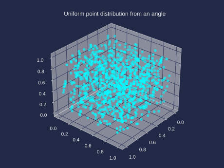
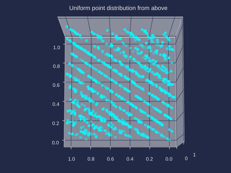
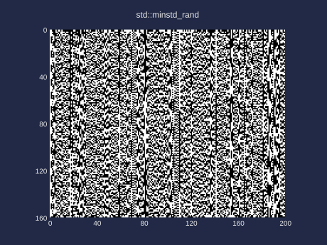
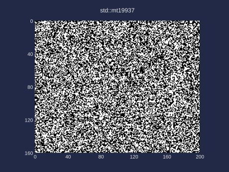
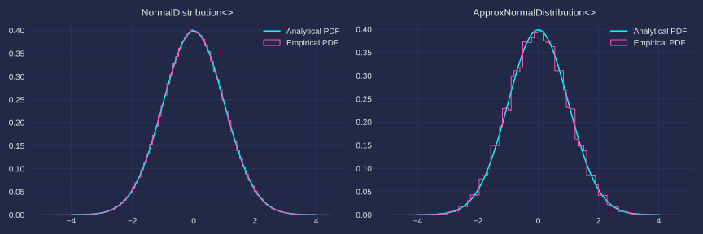

[](https://en.cppreference.com/w/cpp/17.html)
[](../LICENSE.md)
[](guide_versioning.md)
[](https://en.wikipedia.org/wiki/Header-only)
[](https://github.com/DmitriBogdanov/UTL/tree/master/include/UTL)

[](https://github.com/DmitriBogdanov/UTL/actions/workflows/windows.yml)
[](https://github.com/DmitriBogdanov/UTL/actions/workflows/ubuntu.yml)
[](https://github.com/DmitriBogdanov/UTL/actions/workflows/macos.yml)

# utl::random

[<- to README.md](..)

[<- to implementation.hpp](../include/UTL/random.hpp)

**utl::random** module implements several additions to std [&lt;random&gt;](https://en.cppreference.com/w/cpp/header/random) that aim to:

- Make random friendlier for the "naive" use without compromising on quality
- Improve random performance

The module was created during my past work on a thesis that used [stochastic differential equations](https://en.wikipedia.org/wiki/Stochastic_differential_equation) and [Monte—Carlo method](https://en.wikipedia.org/wiki/Monte_Carlo_method) to model explosive heat transfer in a turbulent flow.

It implements several random bit generators seamlessly compatible with [&lt;random&gt;](https://en.cppreference.com/w/cpp/header/random):

- [16-bit Romu Mono PRNG](https://www.romu-random.org/)
- [32-bit Romu Trio PRNG](https://www.romu-random.org/)
- [32-bit SplitMix PRNG](https://dl.acm.org/doi/10.1145/2714064.2660195)
- [32-bit Xoshiro128++ PRNG](https://prng.di.unimi.it/)
- [64-bit Romu Duo Jr. PRNG](https://www.romu-random.org/)
- [64-bit SplitMix PRNG](https://rosettacode.org/wiki/Pseudo-random_numbers/Splitmix64)
- [64-bit Xoshiro256++ PRNG](https://prng.di.unimi.it/)
- [ChaCha8 CSPRNG](https://en.wikipedia.org/wiki/Salsa20#ChaCha_variant)
- [ChaCha12 CSPRNG](https://en.wikipedia.org/wiki/Salsa20#ChaCha_variant)
- [ChaCha20 CSPRNG](https://en.wikipedia.org/wiki/Salsa20#ChaCha_variant)

These pseudorandom number generators (aka [PRNGs](https://en.wikipedia.org/wiki/Pseudorandom_number_generator)) cover most of the common uses cases better than somewhat outdated standard library PRNGs, see [notes on random number generation](#notes-on-random-number-generation).

**Why use `utl::random` over built-in functions?**

- Easier API for most "daily" use cases
- Likely to be [faster](#overview-of-available-prngs) than built-in methods
- Provides [better quality random](#notes-on-random-number-generation) than built-in methods
- Reproducible results, built-in engines may differ compiler to compiler
- Random generators & distributions work even in `constexpr` context
- Almost everything is `noexcept`
- An option to use [cryptographically secure PRNGs](https://en.wikipedia.org/wiki/Cryptographically_secure_pseudorandom_number_generator)
- More reliable sources of entropy than [std::random_device](https://en.cppreference.com/w/cpp/numeric/random/random_device)

## Definitions

```cpp
// PRNG implementations
namespace generators {
    class GeneratorAPI {
        using result_type;
        
        static constexpr result_type min() noexcept;
        static constexpr result_type max() noexcept;
        
        constexpr GeneratorAPI(result_type seed) noexcept;
        constexpr void    seed(result_type seed) noexcept;
        
        template<class SeedSeq> GeneratorAPI(SeedSeq& seq);
        template<class SeedSeq> void    seed(SeedSeq& seq);
        
        constexpr result_type operator()() noexcept;
    };
    
    // 16-bit PRNGs
    class RomuMono16   { /* Generator API */ };
    // 32-bit PRNGs
    class RomuTrio32   { /* Generator API */ };
    class SplitMix32   { /* Generator API */ };
    class Xoshiro128PP { /* Generator API */ };
    // 64-bit PRNGs
    class RomuDuoJr64  { /* Generator API */ };
    class SplitMix64   { /* Generator API */ };
    class Xoshiro256PP { /* Generator API */ };
    // CSPRNGs
    class ChaCha8      { /* Generator API */ };
    class ChaCha12     { /* Generator API */ };
    class ChaCha20     { /* Generator API */ };
}

// Entropy
std::seed_seq entropy_seq();
std::uint32_t entropy();

// Distributions
template <class T>
struct UniformIntDistribution   { /* same API as std::uniform_int_distribution<T>  */ };
template <class T>
struct UniformRealDistribution  { /* same API as std::uniform_real_distribution<T> */ };
template <class T>
struct NormalDistribution       { /* same API as std::normal_distribution<T>       */ };
template <class T>
struct ApproxNormalDistribution { /* same API as std::normal_distribution<T>       */ };

template <class T, class Gen>
constexpr T generate_canonical(Gen& gen) noexcept(noexcept(gen()));

// Default PRNG
using PRNG = generators::Xoshiro256PP;

PRNG& thread_local_prng();

// Convenient random (generic)
template <class Dist> auto variate(Dist&& dist); // any distribution

template <class T> T uniform(T min, T max); // integer U[min, max]
template <class T> T uniform(            ); // boolean U[0, 1]
template <class T> T uniform(T min, T max); // float   U[min, max)
template <class T> T uniform(            ); // float   U[0, 1)

template <class T> T normal(T mean, T stddev); // float N(mean, stddev)
template <class T> T normal(                ); // float N(0, 1)

// Convenient random (shortcuts for standard types)
using Uint = unsigned int;

int    uniform_int   (   int min,    int max); // U[min, max]
Uint   uniform_uint  (  Uint min,   Uint max); // U[min, max]
bool   uniform_bool  (                      ); // U[0, 1]
float  uniform_float ( float min,  float max); // U[min, max)
double uniform_double(double min, double max); // U[min, max)
float  uniform_float (                      ); // U[0, 1)
double uniform_double(                      ); // U[0, 1)

float  normal_float ( float mean,  float stddev); // N(mean, stddev)
double normal_double(double mean, double stddev); // N(mean, stddev)
float  normal_float (                          ); // N(0, 1)
double normal_double(                          ); // N(0, 1)

// Convenient random (other)
template <class T>            T choose(std::initializer_list<T> list);
template <class Container> auto choose(const Container&         list);
```

## Methods

### Random bit generators

> ```cpp
> class GeneratorAPI {
>     using result_type;
> 
>     static constexpr result_type min() noexcept;
>     static constexpr result_type max() noexcept;
> 
>     constexpr GeneratorAPI(result_type seed) noexcept;
>     constexpr void    seed(result_type seed) noexcept;
> 
>     template<class SeedSeq> GeneratorAPI(SeedSeq& seq);
>     template<class SeedSeq> void    seed(SeedSeq& seq);
> 
>     constexpr result_type operator()() noexcept;
> };
> 
> // 16-bit PRNGs
> class RomuMono16   { /* Generator API */ };
> // 32-bit PRNGs
> class RomuTrio32   { /* Generator API */ };
> class SplitMix32   { /* Generator API */ };
> class Xoshiro128PP { /* Generator API */ };
> // 64-bit PRNGs
> class RomuDuoJr64  { /* Generator API */ };
> class SplitMix64   { /* Generator API */ };
> class Xoshiro256PP { /* Generator API */ };
> // CSPRNGs
> class ChaCha8      { /* Generator API */ };
> class ChaCha12     { /* Generator API */ };
> class ChaCha20     { /* Generator API */ };
> ```

All of these generators satisfy [uniform random bit generator generator requirements](https://en.cppreference.com/w/cpp/named_req/UniformRandomBitGenerator) and [std::uniform_random_bit_generator](https://en.cppreference.com/w/cpp/numeric/random/uniform_random_bit_generator) concept, which makes them drop-in replacements for standard generators such as `std::mt19937`.

Unlike standard generators these can also be used in `constexpr` functions.

**Note:** All provided PRNGs have `min() == 0` and `max() == std::numeric_limits<result_type>::max()`.

### Entropy

> ```cpp
> std::seed_seq entropy_seq();
> std::uint32_t entropy();
> ```

These functions serve a role of a "slightly better and more convenient [std::random_device](https://en.cppreference.com/w/cpp/numeric/random/random_device)".

`std::random_device` has a critical deficiency in it's design — in case its implementation doesn't provide a proper source of entropy, it is free to fallback onto a regular PRNGs that don't change from run to run. The method [std::random_device::entropy()](https://en.cppreference.com/w/cpp/numeric/random/random_device/entropy) which should be able to detect that information is notoriously unreliable and returns different things on every platform.

`entropy()` samples several sources of entropy (including the `std::random_device` itself) and is (almost) guaranteed to change from run to run even if it can't provide a proper hardware-sourced entropy that would be suitable for cryptography. It can be used as a drop-in replacement to `std::random_device{}()` calls.

`entropy_seq()` generates a full [std::seed_seq](https://en.cppreference.com/w/cpp/numeric/random/seed_seq) instead of a single number, it is mainly useful for seeding generators with a large state.

**Note:** Entropy functions are thread-safe.

### Distributions

#### Uniform integer distribution

> ```cpp
> template <class T>
> struct UniformIntDistribution {
>     /* ... */
> };
> ```

Uniform integer distribution class that provides a 1-to-1 copy of [`std::uniform_int_distribution`](https://en.cppreference.com/w/cpp/numeric/random/uniform_int_distribution) API, except:

- Everything is `constexpr` and `noexcept`
- `operator()` is `const`-qualified
- `std::uint8_t`, `std::int8_t` and `char`, `std::char8_t`, `std::char16_t`, `std::char32_t` specializations are properly supported
- Distribution sequence is platform-independent

**Note:** This is a close reimplementation of `std::uniform_int_distribution` for [GCC libstdc++](https://github.com/gcc-mirror/gcc) with some additional considerations, it provides similar performance and in some cases may even produce the same sequence.

#### Uniform real distribution

> ```cpp
> template <class T>
> struct UniformRealDistribution {
>     /* ... */
> };
> ```

Uniform floating-point distribution class that provides a 1-to-1 copy of [`std::uniform_real_distribution`](https://en.cppreference.com/w/cpp/numeric/random/uniform_real_distribution) API, except:

- Everything is `constexpr` and `noexcept`
- `operator()` is `const`-qualified
- Performance on a common use case is drastically improved (~1.3 to ~4 times faster `double` and `float` generation)
- Distribution sequence is platform-independent

**Note:** This is a close reimplementation of `std::uniform_real_distribution` for [MSVC STL](https://github.com/microsoft/STL) with some additional considerations and special logic for common optimizable cases.

**How is it faster than std:** Parts of [`std::generate_canonical<>()`](https://en.cppreference.com/w/cpp/numeric/random/generate_canonical) which is used by  `std::uniform_real_distribution` can be moved to `constexpr` , avoiding the runtime `std::log()` computation. Some cases such as `double` & `float` generation with bit-uniform PRNGs (aka all PRNGs of this module and `std::mt19937`) can be handled with a simple bitmask rather than a generic implementation of `std::generate_canonical<>()` which accounts for all the esoteric PRNGs with weird ranges that could exist. This produces a speedup of up to 4 times. Combined with a speedup from faster PRNGs it is possible to achieve **over 10 times faster** random `double` generation in an interval.

> ```cpp
> template <class T, class Gen>
> constexpr T generate_canonical(Gen& gen) noexcept(noexcept(gen()));
> ```

Generates a random floating point number in range $[0, 1)$ similarly to [`std::generate_canonical<>()`](https://en.cppreference.com/w/cpp/numeric/random/generate_canonical).

Always generates `std::numeric_limits<T>::digits` bits of randomness, which is enough to fill the mantissa. See `UniformRealDistribution` for notes on implementation improvements.

#### Normal distribution

> ```cpp
> template <class T>
> struct NormalDistribution {
>     /* ... */
> };
> ```

Normal floating-point distribution class that provides a 1-to-1 copy of [`std::normal_distribution`](https://en.cppreference.com/w/cpp/numeric/random/normal_distribution) API, except:

- Everything is `noexcept`
- Performance on a common use case is slightly improved (~1.1 to ~1.3 times faster distribution)
- Distribution sequence is platform-independent

**How is it faster than std:** It uses faster uniform real distribution for rejection sampling, the underlying [Marsaglia polar method](https://en.wikipedia.org/wiki/Marsaglia_polar_method) itself is implemented exactly the same as in all major compilers.

#### Approximate normal distribution

> ```cpp
> template <class T>
> struct ApproxNormalDistribution {
>     /* ... */
> };
> ```

Normal floating-point distribution class that provides a 1-to-1 copy of [`std::normal_distribution`](https://en.cppreference.com/w/cpp/numeric/random/normal_distribution) API, except:

- Everything is `constexpr` and `noexcept`
- `operator()` is `const`-qualified
- **Extremely** good performance (~4 times faster distribution) at the cost of precision ([see distribution approximations](#distribution-approximations))
- Distribution sequence is platform-independent

**How is it faster than std:** It uses the fact that [popcount](https://en.cppreference.com/w/cpp/numeric/popcount) of a uniformly distributed integer follows a binomial distribution. By rescaling that binomial distribution and adding some linear fill we can achieve a curve very similar to a proper normal distribution in just a few instructions. While that level of precision is not suitable for a general use, in instances where quality is not particularly important (gamedev, fuzzing) this is perhaps the fastest possible way of generating normally distributed floats.

### Default PRNG

> ```cpp
> using PRNG = generators::Xoshiro256PP;
> ```

Typedef for a default PRNG. Good choice for most applications.

> ```cpp
> PRNG& thread_local_prng();
> ```

Thread-local PRNG automatically seeded with entropy.

### Convenient random

> [!Note]
> This is a `rand()`-like API for various distributions. Uses thread-local PRNG lazily seeded with entropy.

### Generic

> ```cpp
> template <class Dist> auto variate(Dist&& dist); // any distribution
> ```

Returns value from distribution `dist` using thread-local random generator.

Effectively equivalent to `dist(thread_local_prng())`.

> ```cpp
> template <class T> T uniform(T min, T max); // integer U[min, max]
> template <class T> T uniform(            ); // boolean U[0, 1]
> ```

Returns random integer `T` in a $[min, max]$ range.

When `T` is a `bool`, function doesn't require any arguments.

> ```cpp
> template <class T> T uniform(T min, T max); // float   U[min, max)
> template <class T> T uniform(            ); // float   U[0, 1)
> ```

Returns random floating point `T` in a $[min, max)$ range.

When no arguments are passed uses $[0, 1)$ range. 

> ```cpp
> template <class T> T normal(T mean, T stddev); // float N(mean, stddev)
> template <class T> T normal(                ); // float N(0, 1)
> ```

Returns random normally distributed `T` with `mean` and `stddev`.

When no arguments are passed uses standard mean and deviation.

### Shortcuts for standard types

> ```cpp
> int    uniform_int   (   int min,    int max); // U[min, max]
> Uint   uniform_uint  (  Uint min,   Uint max); // U[min, max]
> bool   uniform_bool  (                      ); // U[0, 1]
> ```

`int`, `unsigned int` and `bool` instantiations of the integer `uniform<T>()`.

> ```cpp
> float  uniform_float ( float min,  float max); // U[min, max)
> double uniform_double(double min, double max); // U[min, max)
> float  uniform_float (                      ); // U[0, 1)
> double uniform_double(                      ); // U[0, 1)
> ```

`float` and `double` instantiations of the floating point `uniform<T>()`.

> ```cpp
> float  normal_float ( float mean,  float stddev); // N(mean, stddev)
> double normal_double(double mean, double stddev); // N(mean, stddev)
> float  normal_float (                          ); // N(0, 1)
> double normal_double(                          ); // N(0, 1)
> ```

`float` and `double` instantiations of the `normal<T>()`.

### Other

> ```cpp
> template <class T>            T choose(std::initializer_list<T> list);
> template <class Container> auto choose(const Container&         list);
> ```

Returns random element from a `list`.

Generic template requires `Container::at()` and `Container::size()` to exist.

## Examples

### Getting random values

[ [Run this code](https://godbolt.org/z/rfvhEre1P) ]

```cpp
using namespace utl;

// Generic functions
std::cout
    << "integer U[-5, 5] -> " << random::uniform(-5, 5)    << "\n"
    << "boolean U[0, 1]  -> " << random::uniform<bool>()   << "\n"
    << "float   U[1, 2)  -> " << random::uniform(1.f, 2.f) << "\n"
    << "float   U[0, 1)  -> " << random::uniform<float>()  << "\n";

// Standard shortcuts
std::cout
    << "U[0, 1] -> " << random::uniform_bool()  << "\n"
    << "N(0, 1) -> " << random::normal_double() << "\n";

// Other distributions
std::cout
    << "Exp(4) -> " << random::variate(std::exponential_distribution{4.f})  << "\n";
```

Output:
```
integer U[-5, 5] -> 4
boolean U[0, 1]  -> 1
float   U[1, 2)  -> 1.57933
float   U[0, 1)  -> 0.787372

U[0, 1] -> 0
N(0, 1) -> -0.391094

Exp(4) -> 0.384687
```

### Using custom PRNGs with &lt;random&gt;

[ [Run this code](https://godbolt.org/z/bYesn8hfn) ]

```cpp
using namespace utl;

random::generators::SplitMix64 gen{random::entropy()};
std::chi_squared_distribution distr{2.}; // Chi-squared distribution with N = 2

std::cout << "Random value from distribution -> " << distr(gen) << "\n";
```

Output:
```
Random value from distribution -> 4.80049
```

### Constexpr random

[ [Run this code](https://godbolt.org/z/vTzWMd9dc) ]

```cpp
using namespace utl;

template <std::size_t size>
constexpr auto random_integers(std::uint64_t seed, int min, int max) {
    std::array<int, size>          res{};
    random::UniformIntDistribution dist{min, max};
    random::PRNG                   gen(seed);
    
    for (auto &e : res) e = dist(gen);
    return res;
}

// ...

constexpr auto random_array = random_integers<6>(0, -10, 10);

log::println(random_array); // using another module for convenience

// compile-time random like this can be used to automatically build
// lookup tables and generate seemingly random patterns
```

Output:
```
{ -4, -2, -3, -10, 0, -10 }
```

## Improving entropy with x86/x64 intrinsics

`utl::random` can also make use of x86/x64 intrinsics, to enable their usage simply define `UTL_RANDOM_USE_INTRINSICS` before including the header:

```cpp
#define UTL_RANDOM_USE_INTRINSICS
#include "UTL/random.hpp" // will now use intrinsics
```

This achieves two things:

- `entropy()` and `entropy_seq()` will now use CPU-counter intrinsics as an additional source of relatively high-quality entropy
- MSVC will now use a more efficient implementation of 64-bit `UniformIntDistribution`

## Notes on random number generation

As of 2025, the selection of pseudorandom number generators (aka [PRNGs](https://en.wikipedia.org/wiki/Pseudorandom_number_generator)) in the standard library [&lt;random&gt;](https://en.cppreference.com/w/cpp/header/random) is quite outdated, with most generators being developed before year 2000 and providing sub-par characteristics relative to what can be achieved.

While suitable for most uses cases, better performance & quality can be achieved virtually "for free" by switching to some of the newer PRNG implementations.

Thankfully, `<random>` design is quite flexible and fully abstracts the concept of a random bit generator, which makes it seamlessly compatible with any custom PRNG that exposes the necessary API.

`utl::random` provides `<random>`-compatible implementations of several modern PRNGs. By default, rand functions from this header use **Xoshiro256++** as it is well tested, used by several languages ([Rust](https://docs.rs/rand/latest/rand/), [Julia](https://docs.julialang.org/en/v1/stdlib/Random/), slightly different version is used by [.NET](https://devblogs.microsoft.com/dotnet/performance-improvements-in-net-6/), [GNU FORTRAN](https://gcc.gnu.org/fortran/) and [Lua](https://www.lua.org/manual/5.4/manual.html#pdf-math.random)) as their default and provides an excellent balance of speed and statistical quality.

### Overview of available PRNGs

| Generator          | Performance | Memory                         | Result type     | Quality | Period                 | Motivation                    |
| ------------------ | ----------- | ------------------------------ | --------------- | ------- | ---------------------- | ----------------------------- |
| `RomuMono16`       | ~500%       | 4 bytes                        | `std::uint16_t` | ★★☆☆☆   | $\approx 2^{32}$       | Fastest 16-bit PRNG **⁽¹⁾**   |
| `RomuTrio32`       | ~470%       | 12 bytes                       | `std::uint32_t` | ★★☆☆☆   | **Chaotic** **⁽²⁾**    | Fastest 32-bit PRNG           |
| `SplitMix32`       | ~540%       | 4 bytes                        | `std::uint32_t` | ★★★☆☆   | $2^{32}$               | Smallest state 32-bit PRNG    |
| `Xoshiro128PP`     | ~375%       | 16 bytes                       | `std::uint32_t` | ★★★★☆   | $2^{128} − 1$          | Best all purpose 32-bit PRNG  |
| `RomuDuoJr64`      | ~600%       | 16 bytes                       | `std::uint64_t` | ★★☆☆☆   | **Chaotic**            | Fastest 64-bit PRNG           |
| `SplitMix64`       | ~540%       | 8 bytes                        | `std::uint64_t` | ★★★★☆   | $2^{64}$               | Smallest state 64-bit PRNG    |
| `Xoshiro256PP`     | ~385%       | 32 bytes                       | `std::uint64_t` | ★★★★☆   | $2^{256} − 1$          | Best all purpose 64-bit PRNG  |
| `ChaCha8` **⁽³⁾**  | ~125%       | 120 bytes                      | `std::uint32_t` | ★★★★★   | $2^{128}$              | Cryptographically secure PRNG |
| `ChaCha12`         | ~105%       | 120 bytes                      | `std::uint32_t` | ★★★★★   | $2^{128}$              | Cryptographically secure PRNG |
| `ChaCha20`         | ~70%        | 120 bytes                      | `std::uint32_t` | ★★★★★   | $2^{128}$              | Cryptographically secure PRNG |
| `std::minstd_rand` | 100%        | 8 bytes                        | `std::uint64_t` | ★☆☆☆☆   | $2^{31} − 1$           |                               |
| `rand()`           | ~80%        | **Platform-dependent** **⁽⁴⁾** | `int`           | ★☆☆☆☆   | **Platform-dependent** |                               |
| `std::mt19937`     | ~105%       | 5000 bytes                     | `std::uint32_t` | ★★★☆☆   | $2^{19937} − 1$        |                               |
| `std::knuth_b`     | ~55%        | 2064 bytes                     | `std::uint64_t` | ★★☆☆☆   | $2^{31} − 1$           |                               |
| `std::ranlux48`    | ~4%         | 120 bytes                      | `std::uint64_t` | ★★★★☆   | $\approx 2^{576}$      |                               |

> [!Important]
> Performance ratings are **relative to the commonly used  `std::minstd_rand` / `rand()`**.  Particular numbers may differ depending on the hardware and compilation settings, however general trends tend to stay the same. Results above were measured on `AMD Ryzen 5 5600H` with `g++ 11.4.0`. Benchmarks can be found [here](https://github.com/DmitriBogdanov/UTL/tree/master/benchmarks/module_random/).

> [!Important]
> Performance is measured in **values per unit of time**, to get a *bytes per unit of time* metric, the measurements can be normalized by a `sizeof(result_type)`, making 32-bit generators effectively two times slower than listed in the table.

> [!Note]
> **(1)** Here "fastest" also takes into account such things as register pressure and "friendliness" towards instruction-level parallelism, which is not always apparent on a heavily loaded benchmark.

> [!Note]
> **(2)** Non-linear PRNGs also known as "chaotic PRNGs" have a cycle length that is different for each seed. This introduces a theoretical possibility of encountering short cycles, but opens up several avenues for optimization.

> [!Note]
> **(3)** The difference between `ChaCha8`, `ChaCha12` and `ChaCha20` is the number of stream cypher rounds — 8, 12 and 20 correspondingly. More rounds make the state more difficult to discover, but have a negative effect on performance. As of now (year 2025) `ChaCha12` seems like a reasonable default since it provides 5 rounds of security margin over the best known attack.

> [!Note]
> **(4)** `C` function [rand()](https://en.cppreference.com/w/c/numeric/random/rand) is implementation-defined, on most existing implementations it uses an old [LCG](https://en.wikipedia.org/wiki/Linear_congruential_generator) engine similar to `std::minstd_rand`. It is generally an extremely low-quality way of generating random and faces a host of additional issues on platforms with low `RAND_MAX`, which includes Windows where `RAND_MAX` is equal `32767` (less than **2 bytes** of information, an almost ridiculous value, really). **GCC**, which is used in this benchmark, implements `rand()` using [linear feedback shift register](http://en.wikipedia.org/wiki/Linear_feedback_shift_register), which is less likely to encounter the most blatant of issues, but is still ultimately an inferior approach.

Random quality ratings are as follows:

| Quality rating | Usage                            | Quality description                                                                                                                                                                             |
| -------------- | -------------------------------- | ----------------------------------------------------------------------------------------------------------------------------------------------------------------------------------------------- |
| ★★★★★          | Suitable for cryptography        | Cryptographically secure, satisfies [CSPRNG](https://en.wikipedia.org/wiki/Cryptographically_secure_pseudorandom_number_generator) requirements, this usually comes at the price of performance |
| ★★★★☆          | Suitable for most use cases      | No significant issues in qualitative testing, passes [TestU01 Big Crush](https://simul.iro.umontreal.ca/testu01/tu01.html)                                                                      |
| ★★★☆☆          | Suitable for most use cases      | No significant issues in qualitative testing, might fail a few tests on Big Crush                                                                                                               |
| ★★☆☆☆          | Suitable for simple applications | Significant flaws in statistical quality in certain aspects                                                                                                                                     |
| ★☆☆☆☆          | Suitable for simple applications | Significant flaws in statistical quality all-around                                                                                                                                             |

### Why RNG quality matters

Using low-quality random may introduce artificial biases and unexpected effects into what should be a stochastic simulation. Below are some examples of such effects:

- Inaccurate statical estimates in [Monte—Carlo simulations](https://en.wikipedia.org/wiki/Monte_Carlo_method) and stochastic modeling
- Biased optimizations in [genetic algorithms](https://en.wikipedia.org/wiki/Genetic_algorithm)
- Noticeable biases in entity path finding and behavior in games
- Issues in procedural generation

These issues become particularly dangerous and difficult to diagnose in multidimensional simulations, as a lot of older PRNGs have significant statistical issues in higher dimensions that simply aren't apparent in a 1D case. 

In general, most statistical issues fall into following groups:

- Shorter-than-expected periods for some seed states
- Non-uniform distribution of values over the output range
- Correlation of successive values
- Correlation of successive bits in a value
- Correlation of successive seeds
- Poor dimensional distribution of the output sequence

### Visual examples

#### RANDU

The most famous example of low-quality random is IBM's [RANDU](https://en.wikipedia.org/wiki/RANDU) (a variation of the same [LCG](https://en.wikipedia.org/wiki/Linear_congruential_generator) used by most `C` programmers to this day) which was widely used in 1960s and 1970s for the lack of a better knowledge.

As a simplest showcase of its flaws, let's generate `10000` random points in a $[0, 1]^3$ cube, each points will generate with coordinates `{ randu(), randu(), randu() }`. After plotting the resulting picture and looking at it from a correct angle, we can clearly see that all points fall into just **15** distinct planes:

[](guide_reproducing_figures.md)

]](guide_reproducing_figures.md)

What we just observed is called "failing the [spectral test](https://en.wikipedia.org/wiki/Spectral_test) at an extremely low dimension", and for RANDU that dimension is **3**. Such quality is clearly not something one would want in their Monte—Carlo simulation with "random" realizations.

In fact, this quality is generic to all LCGs — any LCG with modulus $m$ used to generate points in $N$-dimensional space will result in no more that $(N! \times m)^{1/N}$ hyperplanes, with other LCG implementations it's just not as noticeable that one could see the planes visually.

#### minstd_rand & rand()

While RANDU algorithm is no longer in use today, its family of algorithms (LCG) is still frequently used through `rand()` and `std::minstd_rand`, with `rand()` being the worst offender as it is the default way of generating random numbers in `C` (`C++` guides and documentation tend to prefer `std::mt19937` which despite not being ideal avoids most of the significant issues).

**Note:** Since nothing in the standard specifies how `rand()` should be implemented it is generally not something one could rely upon, in most cases it's LCG, sometimes it's [linear-feedback shift register](https://en.wikipedia.org/wiki/Linear-feedback_shift_register) which is a little better.

We can easily demonstrate a significant correlation of successive seeds in the default implementation by creating a $160 \times 200$ matrix of random `1`s and `0`s, while re-seeding the generator with `i` at the beginning of each row `i`. This will lead to a following image:

[](guide_reproducing_figures.md)

Using `std::mt19937` (or any other even slightly sensible engine) will not lead to such an horrific correlation, we get a visually uniform image:

[](guide_reproducing_figures.md)

In practice, something like this would be encountered during any stochastic simulation where each run is simulated with a new seed.

### Why not just use Mersenne Twister

One could argue that a widely used [Mersenne Twister](https://en.wikipedia.org/wiki/Mersenne_Twister), which, in case of `C++` is called `std::mt19937` should be good enough for most purposes and that is true. For quite a while Mersenne Twister used to be the default choice for new RNG facilities — it is acceptably performant and has a decent statistical quality with a huge period.

However Mersenne Twister still fails some of the less obvious statistical tests on [TestU01 BigCrush](https://en.wikipedia.org/wiki/TestU01), combined with rather subpar performance relative to the newer methods and a huge state (**5000** bytes against **32** used by Xoshiro256++) there is little reason to use it in a modern environment.

This trend can be observed rather clearly by looking at the lineup of default PRNGs used in different programming languages:

| Language       | Fist release | Default PRNG                                                 | Quality       |
| -------------- | ------------ | ------------------------------------------------------------ | ------------- |
| `C`            | 1972         | LCG                                                          | Bad           |
| `Matlab`       | 1979         | Mersenne Twister                                             | Decent        |
| `C++`          | 1985         | Mersenne Twister / LCG                                       | Decent / Bad  |
| `Python`       | 1991         | Mersenne Twister                                             | Decent        |
| `GNU Octave`   | 1993         | Mersenne Twister                                             | Decent        |
| `Python NumPy` | 2006         | Mersenne Twister (below v.1.17) ➔ PCG64 (above v.1.17)       | Decent ➔ Good |
| `Julia`        | 2012         | Xoshiro256++                                                 | Good          |
| `Rust`         | 2015         | ChaCha12 / Xoshiro256++                                      | Good          |
| `.NET`         | 2016         | Subtractive Generator (below v.6) ➔ Xoshiro256&ast;&ast; (above v.6) | Decent ➔ Good |

While older languages usually stick to their already existing implementations, newer projects tend to choose modern PRNGs for the purpose. This establishes a strong case for switching to using `Xoshiro` / `PCG` family of PRNGs as a default choice in new projects. Engines of families such as `ChaCha` and `ISAAC` also provide cryptographic security to the random sequence, which in essence means that the state of the engine cannot be easily discovered from a piece of its random sequence. This usually has a noticeable performance cost, however even they fair rather well compared to the old monsters such as `std::ranlux48` which runs almost **80 times slower** than Xoshiro256++.

### Additional considerations

#### Output range

In practice, most PRNG outputs aren't used directly as they are generated but rather pass through an additional layer of abstraction such as, for example [`std::uniform_int_distribution`](https://en.cppreference.com/w/cpp/numeric/random/uniform_int_distribution), to compute a distributed value.

This has a noticeable effect on quality and performance of some PRNGs, for example, engines with `::min() != 0` or `::max() != std::numeric_limits<result_type>::max()` are inherently at a disadvantage due to preventing the usage of [Lemire's algorithm](https://arxiv.org/abs/1805.10941) for uniform integer distribution in an interval, which makes `libstdc++` fallback onto a significantly slower generic algorithm, effectively making the PRNG benchmark misleading about real performance.

For this reason all generators selected for this module provide a full range from `0` to `std::numeric_limits<result_type>::max()` and try to avoid "surprises".

#### Seeding

Some engines can be "picky" about zero-seeding or require a non-trivial seeding with [`std::seed_seq`](https://en.cppreference.com/w/cpp/numeric/random/seed_seq) which is cumbersome and difficult to get right. This is exactly the case with widely used `std::mt19937` which is usually seeded like this:

```cpp
std::random_device rd; // create source of entropy

std::mt19937 gen{rd()}; // seed with too little state
```

This is not nearly enough entropy for a huge state of `std::mt19937`, a "proper" way of seeding would be using more entropy and "spreading" it to the state using `std::seed_seq`:

```cpp
std::random_device rd;
std::array<std::mt19937::result_type, std::mt19937::state_size> seed;
std::generate_n(seed.data(), seed.size(), std::ref(rd));
std::seed_seq seq(seed.begin(), seed.end());
std::mt19937 gen(seq);
```

Such approach however is beyond cumbersome and is rarely used in practice, which is why it is sensible to pick generators that work well with a single-number seeding as a default option.

#### Entropy

Unfortunately the is no "nice" and portable way of getting proper cryptographic entropy in the standard library. Main issues were already mentioned in the section documenting [`random::entropy_seq()`](#entropy), the best we can do without using system API is to sample everything we can (`std::random_device`, time in nanoseconds, address space, CPU ticks, some other PRNG and etc.) and use seeding sequence to mash it all together into a single state.

The result of such approach is generally satisfactory, however oftentimes not sufficient for proper cryptographic security.

#### Distribution approximations

Most non-uniform distributions transform their inputs with slow non-linear functions like `std::sqrt()`, `std::log()`, `std::exp()` and etc. In many practical cases (gamedev, fuzzing, rendering) we don't need distributions to be particularly precise, this warrants usage of approximations which can completely avoid non-linear functions and get "close enough" results in a fraction of time.

Below is an example of an empirical [PDF](https://en.wikipedia.org/wiki/Probability_density_function) produced by a regular `NormalDistribution<>` and an  `ApproxNormalDistribution<>` which is about **3–4 times faster** to compute.

[](guide_reproducing_figures.md)