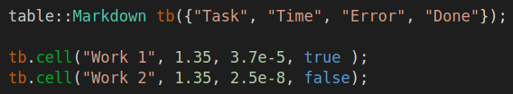
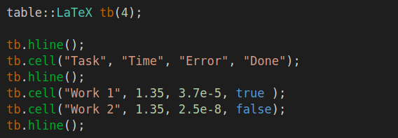
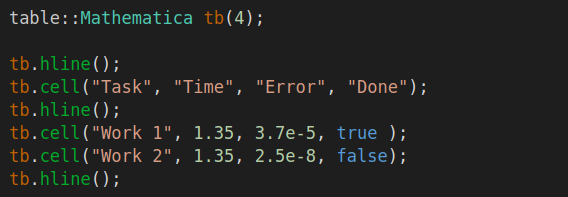

[](https://en.cppreference.com/w/cpp/17.html)
[](https://github.com/DmitriBogdanov/UTL/blob/master/LICENSE.md)
[](guide_versioning.md)
[](https://en.wikipedia.org/wiki/Header-only)
[](https://github.com/DmitriBogdanov/UTL/tree/master/include/UTL)

[](https://github.com/DmitriBogdanov/UTL/actions/workflows/windows.yml)
[](https://github.com/DmitriBogdanov/UTL/actions/workflows/ubuntu.yml)
[](https://github.com/DmitriBogdanov/UTL/actions/workflows/macos.yml)

# utl::table

[<- to README.md](..)

[<- to implementation.hpp](https://github.com/DmitriBogdanov/UTL/blob/master/include/UTL/table.hpp)

**utl::table** is a small header for exporting data to various tabular formats, it supports:

- ASCII
- Markdown
- LaTeX
- Mathematica
- CSV

Useful numerical work with visualization and reports. Main design goals:

- Concise API
- Good performance
- Locale-independent

Below is a quick usage showcase:

| Code                                          | Output                                          |
| --------------------------------------------- | ----------------------------------------------- |
|        |        |
|     |     |
|        |        |
|  |  |
|          |          |

## Definitions

```cpp
// Table formats
struct ASCII {
    explicit ASCII(std::size_t cols);
    
    template <class... T>
    void cell(T&&... args);
    
    void hline();
    
    std::string format() const;
};

struct Markdown {
    explicit Markdown(std::vector<std::string> title);
    
    template <class... T>
    void cell(T&&... args);
    
    std::string format();
};

struct LaTeX {
    explicit LaTeX(std::size_t cols);
    
    template <class... T>
    void cell(T&&... args);
    
    void hline();
    
    std::string format();
};

struct Mathematica {
    explicit Mathematica(std::size_t cols);
    
    template <class... T>
    void cell(T&&... args);
    
    void hline();
    
    std::string format();
};

struct CSV {
    explicit CSV(std::size_t cols) : matrix(cols);
    
    template <class... T>
    void cell(T&&... args);
    
    std::string format();
};

// Number formatting
template <class T>
struct Number {
    constexpr explicit Number(
        T                 value,
        std::chars_format format    = std::chars_format::general,
        int               precision = 3
    ) noexcept;
};
```

## Methods

### Table formats: ASCII

> ```cpp
> explicit ASCII(std::size_t cols);
> ```

Constructs **ASCII** table with `cols` columns.

> ```cpp
> template <class... T>
> void cell(T&&... args);
> ```

Adds one or several cells to the table with `args` as their contents.

`T` can be an instance of any numeric, boolean, or string-convertible type.

**Note:** The table will automatically escape any control chars in the string (such as `\r`, `\n` and etc.) so it can be properly rendered in the terminal.

> ```cpp
> void hline();
> ```

Adds horizontal line to the table.

> ```cpp
> std::string format();
> ```

Formats table into a string.

**Note:** In case last row of the table "wasn't finished", it automatically gets completed with empty cells. This behavior holds true for every format.

### Table formats: Markdown

> ```cpp
> explicit Markdown(std::vector<std::string> title);
> ```

Constructs **Markdown** table with given `title`. This results in `title.size()` columns.

> ```cpp
> template <class... T>
> void cell(T&&... args);
> ```

Adds one or several cells to the table with `args` as their contents.

`T` can be an instance of any numeric, boolean, or string-convertible type.

**Note:** Since Markdown is implementation-defined, there are no specific restrictions imposed on the strings in the table. For example, some markdown flavors might want to export HTML cells, while other would consider such syntax to be invalid.

> ```cpp
> std::string format();
> ```

Formats table into a string.

### Table formats: LaTeX

> ```cpp
> explicit LaTeX(std::size_t cols);
> ```

Constructs **LaTeX** table with `cols` columns.

> ```cpp
> template <class... T>
> void cell(T&&... args);
> ```

Adds one or several cells to the table with `args` as their contents.

`T` can be an instance of any numeric, boolean, or string-convertible type.

**Note 1:** To allow export of hand-written LaTeX expressions, there are no specific restrictions on imposed strings in the table.

**Note 2:** Integer and floating point numbers will be formated as proper LaTeX formulas. This includes numbers in scientific and hex notation.

> ```cpp
> void hline();
> ```

Adds horizontal line to the table.

> ```cpp
> std::string format();
> ```

Formats table into a string.

### Table formats: Mathematica

> ```cpp
> explicit Mathematica(std::size_t cols);
> ```

Constructs **Mathematica** table with `cols` columns.

> ```cpp
> template <class... T>
> void cell(T&&... args);
> ```

Adds one or several cells to the table with `args` as their contents.

`T` can be an instance of any numeric, boolean, or string-convertible type.

**Note 1:** Mathematica strings can include almost any Unicode character. Double-quotes in the string are automatically escaped.

**Note 2:** Floating point numbers in scientific notation are formatted according to the Mathematica specification.

> ```cpp
> void hline();
> ```

Adds horizontal line to the table.

> ```cpp
> std::string format();
> ```

Formats table into a string.

### Table formats: CSV

> ```cpp
> explicit CSV(std::size_t cols);
> ```

Constructs **CSV** table with `cols` columns.

> ```cpp
> template <class... T>
> void cell(T&&... args);
> ```

Adds one or several cells to the table with `args` as their contents.

`T` can be an instance of any numeric, boolean, or string-convertible type.

**Note:** CSV is a format without standardized specification. This library refers to commonly supported [RFC-4180](https://www.rfc-editor.org/info/rfc4180) guidelines for format and special character handling.

> ```cpp
> void hline();
> ```

Adds horizontal line to the table.

> ```cpp
> std::string format();
> ```

Formats table into a string.

### Number formatting

> ```cpp
> template <class T>
> struct Number {
>     constexpr explicit Number(
>         T                 value,
>         std::chars_format format    = std::chars_format::general,
>         int               precision = 3
>     ) noexcept;
> };
> ```

A thin wrapper around the floating-point `value` used to specify its format. See corresponding [example](#floating-point-formatting).

## Examples

### ASCII table

[ [Run this code]() ]

```cpp
utl::table::ASCII tb(4);

tb.hline();
tb.cell("Task", "Time", "Error", "Done");
tb.hline();
tb.cell("Work 1", 1.35, 3.7e-5, true );
tb.cell("Work 2", 1.35, 2.5e-8, false);
tb.hline();

std::cout << tb.format();
```

Output:

```
|--------|------|---------|-------|
| Task   | Time | Error   | Done  |
|--------|------|---------|-------|
| Work 1 | 1.35 | 3.7e-05 | true  |
| Work 2 | 1.35 | 2.5e-08 | false |
|--------|------|---------|-------|
```

### Markdown table

[ [Run this code]() ]

```cpp
utl::table::Markdown tb({"Task", "Time", "Error", "Done"});

tb.cell("Work 1", 1.35, 3.7e-5, true );
tb.cell("Work 2", 1.35, 2.5e-8, false);

std::cout << tb.format();
```

Output:

```
| Task   | Time | Error   | Done    |
| ------ | ---- | ------- | ------- |
| Work 1 | 1.35 | 3.7e-05 | `true`  |
| Work 2 | 1.35 | 2.5e-08 | `false` |
```

### LaTeX table

[ [Run this code]() ]

```cpp
utl::table::LaTeX tb(4);

tb.hline();
tb.cell("Task", "Time", "Error", "Done");
tb.hline();
tb.cell("Work 1", 1.35, 3.7e-5, true );
tb.cell("Work 2", 1.35, 2.5e-8, false);
tb.hline();

std::cout << tb.format();
```

Output:

```
\begin{tabular}{|c|c|c|c|}
\hline
    Task   & Time   & Error               & Done  \\
\hline
    Work 1 & $1.35$ & $3.7 \cdot 10^{-5}$ & true  \\
    Work 2 & $1.35$ & $2.5 \cdot 10^{-8}$ & false \\
\hline
\end{tabular}
```

### Mathematica table

[ [Run this code]() ]

```cpp
utl::table::Mathematica tb(4);

tb.hline();
tb.cell("Task", "Time", "Error", "Done");
tb.hline();
tb.cell("Work 1", 1.35, 3.7e-5, true );
tb.cell("Work 2", 1.35, 2.5e-8, false);
tb.hline();

std::cout << tb.format();
```

Output:

```
Grid[{
    { "Task"  , "Time", "Error" , "Done" },
    { "Work 1", 1.35  , 3.7*^-05, True   },
    { "Work 2", 1.35  , 2.5*^-08, False  }
}, Dividers -> {All, {True, True, False, True}}]
```

### CSV table

[ [Run this code]() ]

```cpp
utl::table::CSV tb(4);

tb.cell("Task", "Time", "Error", "Done");
tb.cell("Work 1", 1.35, 3.7e-5, true );
tb.cell("Work 2", 1.35, 2.5e-8, false);

std::cout << tb.format();
```

Output:

```
"Task","Time","Error","Done"
"Work 1",1.35,3.7e-05,true
"Work 2",1.35,2.5e-08,false
```

### Floating-point formatting

[ [Run this code]() ]

```cpp
using namespace utl;

const auto format_number = [](double x) { return table::Number{x, std::chars_format::scientific, 1}; };

table::Markdown tb({"Method", "Error"});

tb.cell("Jacobi", format_number(3.475e-4));
tb.cell("Seidel", format_number(6.732e-6));

std::cout << tb.format();
```

Output:

```
| Method | Error   |
| ------ | ------- |
| Jacobi | 3.5e-04 |
| Seidel | 6.7e-06 |
```

### Filling table cell-by-cell

[ [Run this code]() ]

```cpp
utl::table::Markdown tb({"Method", "Error", "Converged"});

// 1 call to 'cell()' doesn't necessarily have to fill the entire row at once
tb.cell("Jacobi");
tb.cell(3.475e-4);
tb.cell(false);

tb.cell("Seidel");
tb.cell(6.732e-6, true);

std::cout << tb.format();
```

Output:

```
| Method | Error     | Converged |
| ------ | --------- | --------- |
| Jacobi | 0.0003475 | `false`   |
| Seidel | 6.732e-06 | `true`    |
```
